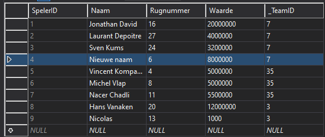

# Opdracht-EF

### VoegSpelerToe en SelecteerTeam

```c
Speler speler = new Speler("Nicolas", 13, 1000, teamRepo.SelecteerTeam(3));
spelerRepo.VoegSpelerToe(speler);
```
#### databank:


### VoegTeamToe

```c
Team team = new Team(69, "team naam", "bijnaam", "trainer");
teamRepo.VoegTeamToe(team);
```
#### databank:


### VoegTransferToe en SelecteerTeam en SelecteerSpeler

```c
Transfer transfer = new Transfer(spelerRepo.SelecteerSpeler(5), 55555.55, teamRepo.SelecteerTeam(35), teamRepo.SelecteerTeam(3));
TransferRepo.VoegTransferToe(transfer);
```
#### databank:


### UpdateSpeler

```c
Speler spelerUpdate = spelerRepo.SelecteerSpeler(4);
spelerUpdate.Naam = "Nieuwe naam";
spelerRepo.UpdateSpeler(spelerUpdate);
```
#### databank:


